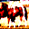

# Fast Gradient Sign Method (FGSM) Adversarial Attacks
In this repository one of the adversarial attacks called FGSM is examined and applied on VGG-19 for image classification.

# Dataset for Image Classification
<ul>
	<li>
		<a href="https://www.cs.toronto.edu/~kriz/cifar.html">Cifar-10</a>
		<ul>
			<li>
				<strong>Labels:</strong> 
				<ul>
					<li>
						[<code>airplane</code>, <code>automobile</code>, <code>bird</code>, <code>cat</code>, <code>deer</code>, <code>dog</code>, <code>frog</code>, <code>horse</code>, <code>ship</code>, <code>truck</code>]
					</li>
				</ul>
			</li>
			<li>
				<strong>Training vs Testing Distribution:</strong>
				<table style="text-align: center margin-left: auto; margin-right: auto; text-align: center" border=0 align=center>
				    <tbody>
				        <tr>
				            <td>
				                
				            </td>
				        </tr>
				    </tbody>
				</table>
			</li>
			<li>
				<strong>Some samples from training and testing data:</strong>
			</li>
		</ul>
	</li>
</ul>

<table style="text-align: center margin-left: auto; margin-right: auto; text-align: center" border=0 align=center>
    <tbody style="text-align: center margin-left: auto; margin-right: auto; text-align: center" border=0 align=center>
        <tr>
            <td>
                
            </td>
        </tr>
        <tr>
        	<td>
        		A sample from Training Data
        	</td>
        </tr>
    </tbody>
</table>

<table style="text-align: center margin-left: auto; margin-right: auto; text-align: center" border=0 align=center>
    <tbody style="text-align: center margin-left: auto; margin-right: auto; text-align: center" border=0 align=center>
        <tr>
            <td>
                
            </td>
        </tr>
        <tr>
        	<td>
        		A sample from Testing Data
        	</td>
        </tr>
    </tbody>
</table>

# VGG-19 as an Image Classifier

To increase the convergence speed of the model, transfer learning has been used. For this purpose, a pretrained VGG on ImageNet dataset has been used for image classification. To match the output of the model with the number of classes, the final layer of the model is replaced by a fully connected layer with an output of the number of classes. Details of the classifier are available below:

<ul>
	<li>
		Model: <strong>VGG-19</strong>
	</li>
	<li>
		Loss: <strong>Cross-Entropy</strong>
		<ul>
			<li>Since this is a <strong>classification problem</strong>, <strong>"Cross-Entropy"</strong> loss function is used.</li>
		</ul>
	</li>
	<li> 
		Optimizer: <strong>Adam</strong>
	</li>
	<li>
		Hyper-Parameters:
	</li>
</ul>

<table style="text-align: center margin-left: auto; margin-right: auto; text-align: center" border=0 align=center>
	<thead>
		<tr>
			<th colspan=2>Hyper-Parameter</th>
			<th>Value</th>
		</tr>
	</thead>
    <tbody style="text-align: center margin-left: auto; margin-right: auto; text-align: center" border=0 align=center>
        <tr>
            <td colspan=2>
                Number of Epochs
            </td>
            <td>
                50
            </td>
        </tr>
        <tr>
            <td colspan=2>
                Batch-Size
            </td>
            <td>
                64
            </td>
        </tr>
        <tr>
            <td rowspan=2>
                Learning Rate Scheduler
            </td>
            <td>
                Method
            </td>
            <td>
            	Reduce LR on Plateau
            </td>
        </tr>
        <tr>
        	<td>
        		Initial Learning Rate
        	</td>
        	<td>
        		1e-3
        	</td>
        </tr>
        <tr>
            <td rowspan=2>
                Optimization Algorithm (Adam)
            </td>
            <td>
                Weigth Decay
            </td>
            <td>
            	5e-4
            </td>
        </tr>
    </tbody>
</table>

# Results: Loss Values

<table style="text-align: center margin-left: auto; margin-right: auto; text-align: center" border=0 align=center>
	<thead>
	</thead>
    <tbody style="text-align: center margin-left: auto; margin-right: auto; text-align: center" border=0 align=center>
        <tr>
            <td>
                
            </td>
        </tr>
        <tr>
        	<td colspan=3>
        		The loss value of pretrained VGG-19 (on ImageNet) after training on Cifar-10
        	</td>
        </tr>
    </tbody>
</table>

# Results: Accuracy

<table style="text-align: center margin-left: auto; margin-right: auto; text-align: center" border=0 align=center>
	<thead>
		<tr>
			<td>
				Top-1
			</td>
			<td>
				Top-2
			</td>
		</tr>
	</thead>
    <tbody style="text-align: center margin-left: auto; margin-right: auto; text-align: center" border=0 align=center>
        <tr>
            <td>
                
            </td>
            <td>
                
            </td>
        </tr>
        <tr>
        	<td colspan=3>
        		Top-1 and top-2 accuracies of pretrained VGG-19 (on ImageNet) after training on Cifar-10
        	</td>
        </tr>
    </tbody>
</table>

# Results: Learning Rate Scheduling

<table style="text-align: center margin-left: auto; margin-right: auto; text-align: center" border=0 align=center>
	<thead>
	</thead>
    <tbody style="text-align: center margin-left: auto; margin-right: auto; text-align: center" border=0 align=center>
        <tr>
            <td>
                
            </td>
        </tr>
        <tr>
        	<td colspan=3>
        		Learning rate scheduling of pretrained VGG-19 (on ImageNet) after training on Cifar-10
        	</td>
        </tr>
    </tbody>
</table>

# FGSM Adversarial Attacks

FGSM method is a white-box method,this means it must have the network. This method is based on the idea that since neural networks are trained based on Gradient Descent to reach the local minimum, if it moves in the opposite direction of Gradient Descent, the input can be slightly changed. This amount of perturbation applied to the input image is so small that if it is added to the input image, the perception of the image will not make a difference to the human user:

$$ X' = X + \epsilon \ sign( \nabla_X J(\theta, X, Y) ) $$

# FGSM Results
The value of $\epsilon$ in FGSM method is set to 0.05 .

<table style="text-align: center margin-left: auto; margin-right: auto; text-align: center" border=0 align=center>
	<thead>
	</thead>
    <tbody style="text-align: center margin-left: auto; margin-right: auto; text-align: center" border=0 align=center>
        <tr>
            <td>
                
            </td>
            <td>
            	+ 0.05 ×
            </td>
            <td>
                
            </td>
            <td>
            	=
            </td>
            <td>
                
            </td>
        </tr>
        <tr>
            <td>
                <strong>Horse</strong>
            </td>
            <td>
            </td>
            <td>
            </td>
            <td>
            </td>
            <td>
                <strong>Deer</strong>
            </td>
        </tr>
        <tr>
            <td>
                
            </td>
            <td>
            	+ 0.05 ×
            </td>
            <td>
                
            </td>
            <td>
            	=
            </td>
            <td>
                
            </td>
        </tr>
        <tr>
            <td>
                <strong>Automobile</strong>
            </td>
            <td>
            </td>
            <td>
            </td>
            <td>
            </td>
            <td>
                <strong>Airplane</strong>
            </td>
        </tr>
    </tbody>
</table>

