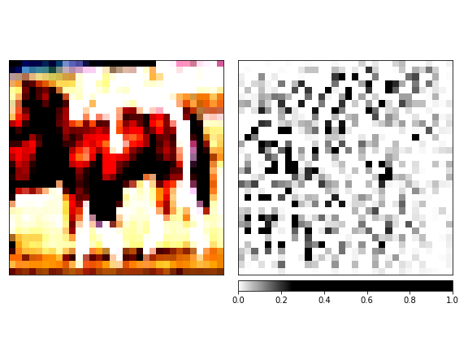

# Fast Gradient Sign Method (FGSM) Adversarial Attacks
In this repository one of the adversarial attacks called FGSM is examined and applied on VGG-19 for image classification.

# Dataset for Image Classification
<ul>
	<li>
		<a href="https://www.cs.toronto.edu/~kriz/cifar.html">Cifar-10</a>
		<ul>
			<li>
				<strong>Labels:</strong> 
				<ul>
					<li>
						[<code>airplane</code>, <code>automobile</code>, <code>bird</code>, <code>cat</code>, <code>deer</code>, <code>dog</code>, <code>frog</code>, <code>horse</code>, <code>ship</code>, <code>truck</code>]
					</li>
				</ul>
			</li>
			<li>
				<strong>Training vs Testing Distribution:</strong>
				<table style="text-align: center margin-left: auto; margin-right: auto; text-align: center" border=0 align=center>
				    <tbody>
				        <tr>
				            <td>
				                
				            </td>
				        </tr>
				    </tbody>
				</table>
			</li>
			<li>
				<strong>Some samples from training and testing data:</strong>
			</li>
		</ul>
	</li>
</ul>

<table style="text-align: center margin-left: auto; margin-right: auto; text-align: center" border=0 align=center>
    <tbody style="text-align: center margin-left: auto; margin-right: auto; text-align: center" border=0 align=center>
        <tr>
            <td>
                
            </td>
        </tr>
        <tr>
        	<td>
        		A sample from Training Data
        	</td>
        </tr>
    </tbody>
</table>

<table style="text-align: center margin-left: auto; margin-right: auto; text-align: center" border=0 align=center>
    <tbody style="text-align: center margin-left: auto; margin-right: auto; text-align: center" border=0 align=center>
        <tr>
            <td>
                
            </td>
        </tr>
        <tr>
        	<td>
        		A sample from Testing Data
        	</td>
        </tr>
    </tbody>
</table>

# VGG-19 as an Image Classifier

To increase the convergence speed of the model, transfer learning has been used. For this purpose, a pretrained VGG on ImageNet dataset has been used for image classification. To match the output of the model with the number of classes, the final layer of the model is replaced by a fully connected layer with an output of the number of classes. Details of the classifier are available below:

<ul>
	<li>
		Model: <strong>VGG-19</strong>
	</li>
	<li>
		Loss: <strong>Cross-Entropy</strong>
		<ul>
			<li>Since this is a <strong>classification problem</strong>, <strong>"Cross-Entropy"</strong> loss function is used.</li>
		</ul>
	</li>
	<li> 
		Optimizer: <strong>Adam</strong>
	</li>
	<li>
		Hyper-Parameters:
	</li>
</ul>

<table style="text-align: center margin-left: auto; margin-right: auto; text-align: center" border=0 align=center>
	<thead>
		<tr>
			<th colspan=2>Hyper-Parameter</th>
			<th>Value</th>
		</tr>
	</thead>
    <tbody style="text-align: center margin-left: auto; margin-right: auto; text-align: center" border=0 align=center>
        <tr>
            <td colspan=2>
                Number of Epochs
            </td>
            <td>
                50
            </td>
        </tr>
        <tr>
            <td colspan=2>
                Batch-Size
            </td>
            <td>
                64
            </td>
        </tr>
        <tr>
            <td rowspan=2>
                Learning Rate Scheduler
            </td>
            <td>
                Method
            </td>
            <td>
            	Reduce LR on Plateau
            </td>
        </tr>
        <tr>
        	<td>
        		Initial Learning Rate
        	</td>
        	<td>
        		1e-3
        	</td>
        </tr>
        <tr>
            <td rowspan=2>
                Optimization Algorithm (Adam)
            </td>
            <td>
                Weigth Decay
            </td>
            <td>
            	5e-4
            </td>
        </tr>
    </tbody>
</table>

# Results: Loss Values

<table style="text-align: center margin-left: auto; margin-right: auto; text-align: center" border=0 align=center>
	<thead>
	</thead>
    <tbody style="text-align: center margin-left: auto; margin-right: auto; text-align: center" border=0 align=center>
        <tr>
            <td>
                
            </td>
        </tr>
        <tr>
        	<td colspan=3>
        		The loss value of pretrained VGG-19 (on ImageNet) after training on Cifar-10
        	</td>
        </tr>
    </tbody>
</table>

# Results: Accuracy

<table style="text-align: center margin-left: auto; margin-right: auto; text-align: center" border=0 align=center>
	<thead>
		<tr>
			<td>
				Top-1
			</td>
			<td>
				Top-2
			</td>
		</tr>
	</thead>
    <tbody style="text-align: center margin-left: auto; margin-right: auto; text-align: center" border=0 align=center>
        <tr>
            <td>
                
            </td>
            <td>
                
            </td>
        </tr>
        <tr>
        	<td colspan=3>
        		Top-1 and top-2 accuracies of pretrained VGG-19 (on ImageNet) after training on Cifar-10
        	</td>
        </tr>
    </tbody>
</table>

# Results: Learning Rate Scheduling

<table style="text-align: center margin-left: auto; margin-right: auto; text-align: center" border=0 align=center>
	<thead>
	</thead>
    <tbody style="text-align: center margin-left: auto; margin-right: auto; text-align: center" border=0 align=center>
        <tr>
            <td>
                
            </td>
        </tr>
        <tr>
        	<td colspan=3>
        		Learning rate scheduling of pretrained VGG-19 (on ImageNet) after training on Cifar-10
        	</td>
        </tr>
    </tbody>
</table>

# FGSM Adversarial Attacks

FGSM method is a white-box method,this means it must have the network. This method is based on the idea that since neural networks are trained based on Gradient Descent to reach the local minimum, if it moves in the opposite direction of Gradient Descent, the input can be slightly changed. This amount of perturbation applied to the input image is so small that if it is added to the input image, the perception of the image will not make a difference to the human user:

$$ X' = X + \epsilon \ sign( \nabla_X J(\theta, X, Y) ) $$

# FGSM Results
The value of $\epsilon$ in FGSM method is set to 0.05 .

<table style="text-align: center margin-left: auto; margin-right: auto; text-align: center" border=0 align=center>
	<thead>
	</thead>
    <tbody style="text-align: center margin-left: auto; margin-right: auto; text-align: center" border=0 align=center>
        <tr>
            <td>
                
            </td>
            <td>
            	+ 0.05 ×
            </td>
            <td>
                
            </td>
            <td>
            	=
            </td>
            <td>
                
            </td>
        </tr>
        <tr>
            <td>
                <strong>Horse</strong>
            </td>
            <td>
            </td>
            <td>
            </td>
            <td>
            </td>
            <td>
                <strong>Deer</strong>
            </td>
        </tr>
        <tr>
            <td>
                
            </td>
            <td>
            	+ 0.05 ×
            </td>
            <td>
                
            </td>
            <td>
            	=
            </td>
            <td>
                
            </td>
        </tr>
        <tr>
            <td>
                <strong>Automobile</strong>
            </td>
            <td>
            </td>
            <td>
            </td>
            <td>
            </td>
            <td>
                <strong>Airplane</strong>
            </td>
        </tr>
    </tbody>
</table>

# Defense to Adversarial Attack

To defend to adversarial attack, different methods have been provided, two of them are as follows:

<ul>
    <li>
        <strong> Training with Adversarial Data </strong>
        <ul>
            <li>
                In this method, methods such as FGSM are used as a Data Augmentation method and the network is trained with augmented data from adversarial methods. This makes the network somewhat resistant to adversarial attack.
            </li>
        </ul>
    </li>
    <li>
        <strong> Distillation as a Defense to Adversarial Attack </strong>
        <ul>
            <li>
                In this method, first a deep network is trained and then by distilling the knowledge, the knowledge learned by this model is transferred to a shallower model.
            </li>
        </ul>
    </li>
</ul>

# Distillation as a Defense to Adversarial Attack

As mentioned above, distilling the knowledge learned by the model into a smaller model is one way to deal with adversarial attacks. By using knowledge distillation, we transfer the knowledge learned by VGG-19 to VGG-11 network.

As can be seen in the figure below, this method has somewhat increased the resistance of the model against adversarial attacks. Since the VGG-11 model is still considered as a deep model, this increase in resistance is not so great. 

<table style="text-align: center margin-left: auto; margin-right: auto; text-align: center" border=0 align=center>
    <thead>
    </thead>
    <tbody style="text-align: center margin-left: auto; margin-right: auto; text-align: center" border=0 align=center>
        <tr>
            <td>
                
            </td>
            <td>
                
            </td>
        </tr>
        <tr>
            <td>
                a
            </td>
            <td>
                b
            </td>
        </tr>
        <tr>
            <td colspan=2>
                The accuracy of VGG-19 and VGG-11 models trained for different values of 𝜖 on a) training and b) test data
            </td>
        </tr>
    </tbody>
</table>

# Visualization

The purpose of visualization is to understand the behavior of the network. For this purpose, we use the following two methods to visualizate the network:

<ul>
    <li>
        Integrated Gradient
    </li>
    <li>
        Gradient Shap
    </li>
</ul>

As can be seen in the visualizations, the network pays attention to the whole image, which was also noticeable before these visualizations; Because the size of the image is not much bigger than the convolution layer filters and the network can easily pay attention to the whole image.

<table style="text-align: center margin-left: auto; margin-right: auto; text-align: center" border=0 align=center>
    <thead>
        <tr>
            <td></td>
            <td>
                VGG-19
            </td>
            <td>
                VGG-11
            </td>
        </tr>
    </thead>
    <tbody style="text-align: center margin-left: auto; margin-right: auto; text-align: center" border=0 align=center>
        <tr>
            <td>
                Original Image
            </td>
            <td>
                
            </td>
            <td>
                
            </td>
        </tr>
        <tr>
            <td>
                Integrated Gradients
            </td>
            <td>
                
            </td>
            <td>
                
            </td>
        </tr>
        <tr>
            <td>
                Gradient Shap
            </td>
            <td>
                
            </td>
            <td>
                
            </td>
        </tr>
        <tr>
            <td colspan=3>
                Examining different visualization of the network
            </td>
        </tr>
    </tbody>
</table>

# Pretrained Models & Reports

<ul>
    <li>
        <a href="https://drive.google.com/drive/folders/1gM2z7mOwlycvdrvGH0pTtXzTEWY6IOvK?usp=sharing">
            Link
        </a>
    </li>
</ul>

# References

<ul>
    <li>
        <a href="https://arxiv.org/abs/1412.6572"> 
            Ian J. Goodfellow, Jonathon Shlens, and Christian Szegedy, “<strong>Explaining and Harnessing Adversarial Examples</strong>”, arXiv: 1412.6572v3 [stat.ML], Mar. 2015.
        </a>
    </li>
    <li>
        <a href="https://arxiv.org/abs/1511.04508">
            Nicolas Papernot, Patrick McDaniel, Xi Wu, Somesh Jha, and Ananthram Swami, “<strong>Distillation as a Defense to Adversarial Perturbations against Deep Neural Networks</strong>”, arXiv:1511.04508v2 [cs.CR], Mar. 2016.
        </a>
    </li>
</ul>